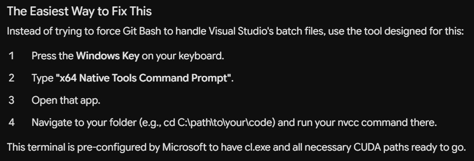

### COMPILATION ERROR
```sh
C:\Users\alok4\Desktop\Cuda>nvcc 01.1_indxing.cu -o a.exe
01.1_indxing.cu

C:\Program Files\NVIDIA GPU Computing Toolkit\CUDA\v11.7\include\crt/host_config.h(153): fatal error C1189: #error:  -- unsupported Microsoft Visual Studio version! Only the versions between 2017 and 2022 (inclusive) are supported! The nvcc flag '-allow-unsupported-compiler' can be used to override this version check; however, using an unsupported host compiler may cause compilation failure or incorrect run time execution. Use at your own risk.
```

```sh
C:\Users\alok4\Desktop\Cuda>nvcc 01.1_indxing.cu -o a.exe -allow-unsupported-compiler
01.1_indxing.cu
C:\Program Files\Microsoft Visual Studio\2022\Community\VC\Tools\MSVC\14.44.35207\include\yvals_core.h(902): error: static assertion failed with "error STL1002: Unexpected compiler version, expected CUDA 12.4 or newer."

1 error detected in the compilation of "01.1_indxing.cu".

```sh
C:\Users\alok4\Desktop\Cuda>nvcc 01.1_indxing.cu -o a.exe -allow-unsupported-compiler -D_ALLOW_COMPILER_AND_STL_VERSION_MISMATCH
```

There were some errors faced, which finally got resolved on bypassing above checks, and also doing 

